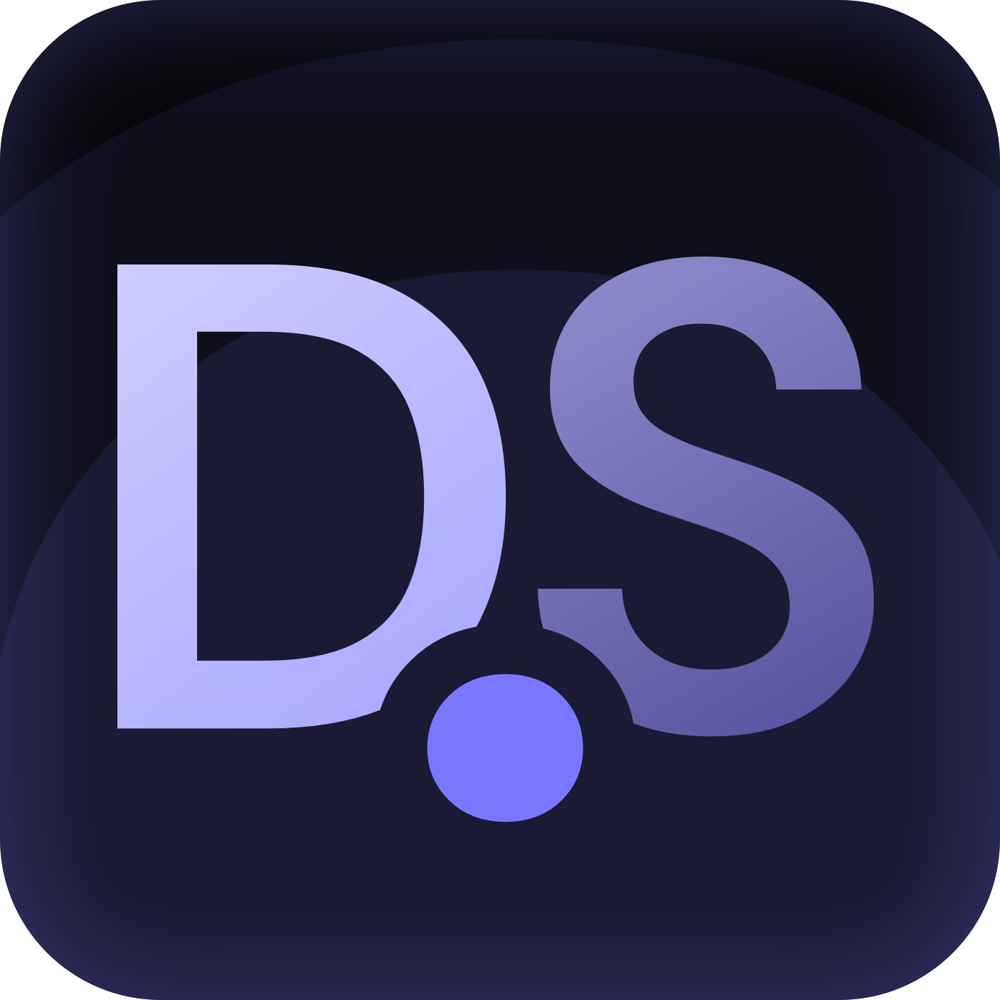

<p align="center">
  
</p>

<h1 align="center">detection.studio</h1>

<p align="center">
  <a href="https://opensource.org/licenses/MIT"></a>
  <a href="https://vuejs.org/"></a>
  <a href="https://pyodide.org/"></a>
  <a href="https://detection.studio"></a>
  <a href="https://github.com/northsh/detection.studio/actions/workflows/deploy.yml"></a>
</p>

<p align="center">
  <strong>Convert Sigma rules to SIEM queries, directly in your browser.</strong>
</p>

<p align="center">
  You can access the tool at:<br />
  <a href="https://detection.studio"><strong>detection.studio</strong></a>
</p>

## About

[detection.studio](https://detection.studio/) is a privacy-focused tool for security professionals to convert Sigma detection rules to SIEM-specific languages (like Splunk SPL, Elasticsearch ES|QL, Grafana Loki etc.) entirely in the browser. No server processing means your sensitive detection rules never leave your device.

> If you're unfamiliar with the Sigma detection format, or how it can benefit your SIEM detection strategy, [visit the documentation](https://sigmahq.io/) to get yourself familiarized.

## Features

- **In-Browser Conversion**: All conversions happen locally in your browser
- **Pipeline & Filter Templates**: Better support with intuitive UI
- **Persistent Workspaces**: Automatic saving to local storage
- **Share & Export**: Easily share your work or export to ZIP
- **Familiar Interface**: File-manager style UI for managing detection rules

## Build & Deploy Locally

[If you want to run detection.studio](https://detection.studio/) locally, you can follow these steps:

### Installation

After installing `bun` from https://bun.sh/, run the following commands

```bash
# Install dependencies (bun preferred)
bun install

# Start dev server
bun run dev

# Build for production
bun run build
```

## SIEM Support

[detection.studio](https://detection.studio/) currently supports conversion to:

- Splunk SPL
- Elasticsearch ES|QL
- Grafana Loki
- And more via the pySigma ecosystem

## Roadmap

The roadmap is [generally available here on Github](https://github.com/orgs/northsh/projects/1/views/1). The project is open-source and contributions are welcome.

## Contributing

Contributions are welcome! For feature requests, bug reports or questions, please open an issue. If you'd like to contribute code, please open a pull request.

- `bun` is the preferred package manager for the project

## License

This project is licensed under the [MIT License](LICENSE).

## Acknowledgements

- [SigConverter.io](https://sigconverter.io) - Server licensed under Apache 2.0
- [SigmaHQ](https://sigmahq.io/) - For the fantastic Sigma project
- [Pyodide](https://pyodide.org/) - For making Python in the browser possible

---

<p align="center">
  by north.sh
</p>